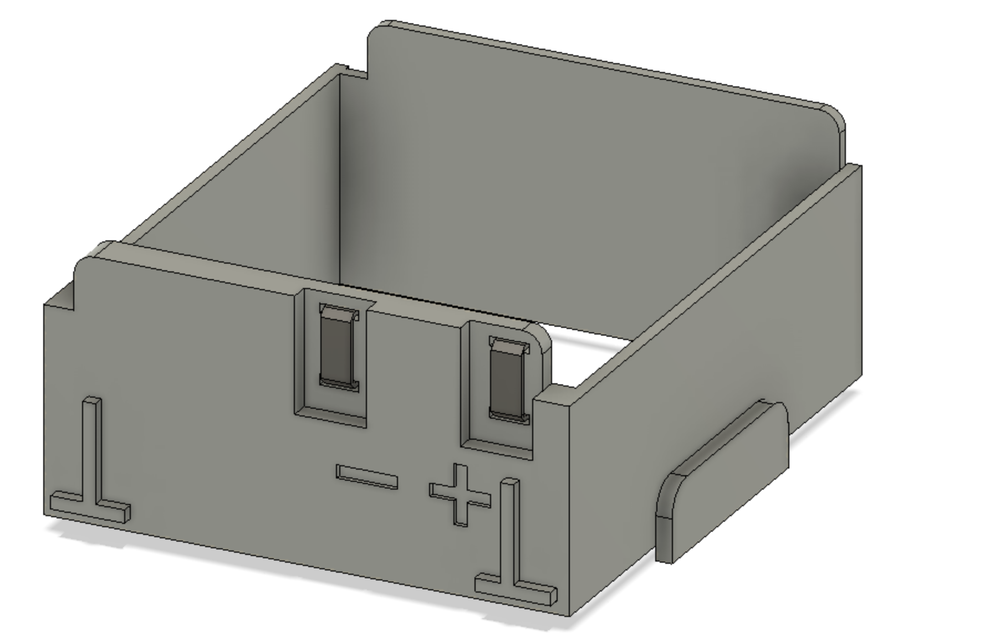

## Lego Control+ Hub no 2 (Liebherr 9800 / 42100) Compatible Battery Box Insert
### Useful for substituting external power or a LiPo battery

*[Photos of Hub's PCB including breakdown major chips](https://flickr.com/photos/147573503@N04/albums/72157711852953692/)
* STM32L431RCT6 microcontroller, TI CC2640 BLE, LB1836 motor driver 
* Nov 19, 2019 Jan Kujawa batterybox@isbroken.com